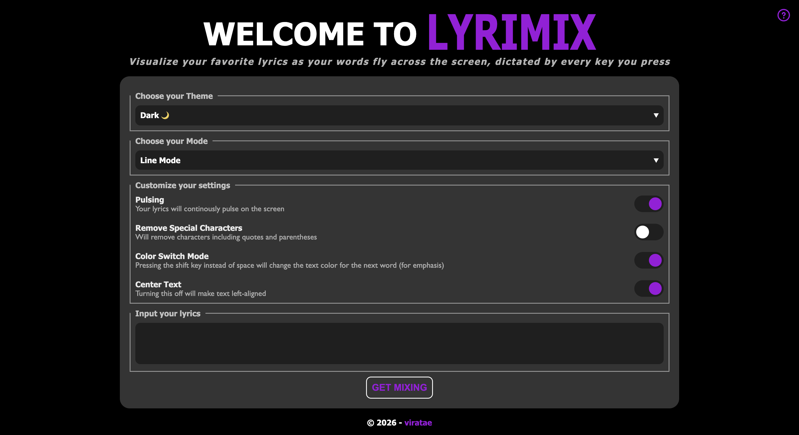

# Lyrimix 
### &rarr; [Live Preview](https://viratae.github.io/lyrimix/)

### Lyrimix is a customizable to visualize lyrics and words. By simply pressing different keys, users are able to control the timing, color, and display of their chosen words. Great for lyric videos and other forms of media!

## Features
- Allows users to control **line breakage, display timing, colors, and more**
- Includes **4 different themes** saved using local storage
- Features **4 special settings** to further customize display

## Built With

*(Javascript, HTML, CSS, Git, GitHub, Visual Studio Code)*

## Demo
Customize your settings, theme, color, and lyrics before using the arrow keys to make the words fly across the screen!

<video src="images/mammaMiaDemo.mov" controls></video>

Try out our different themes!
